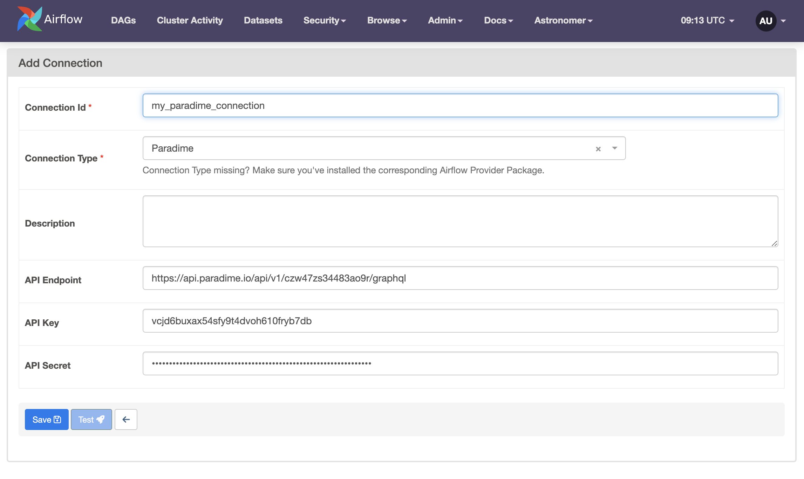

<p align="center">
  <a href="https://www.paradime.io">
        
    </a>
</p>

<h1 align="center">
  airflow-provider-paradime-dbt
</h1>


This is the provider for Paradime to run and manage dbt™ jobs in production. The provider enables interaction with Paradime’s Bolt scheduler and management APIs.

## Usage

### Create a connection
1. Generate your API key, secret and endpoint from Paradime Workspace settings.
2. Create a connection in Airflow, as shown below.


### Create a DAG

Here is one example:
```py
from airflow.decorators import dag

from paradime_dbt_provider.operators.paradime import ParadimeBoltDbtScheduleRunArtifactOperator, ParadimeBoltDbtScheduleRunOperator
from paradime_dbt_provider.sensors.paradime import ParadimeBoltDbtScheduleRunSensor


@dag(
    default_args={"conn_id": "my_paradime_connection"},
)
def run_schedule_and_download_manifest():
    """
    This DAG will run a dbt schedule and download the manifest.json file from the schedule run.
    """

    # Run the schedule and return the run id as the xcom return value
    task_run_schedule = ParadimeBoltDbtScheduleRunOperator(task_id="run_schedule", schedule_name="your_schedule_name")  # Update this to your schedule name

    # Get the run id from the xcom return value
    run_id = "{{ task_instance.xcom_pull(task_ids='run_schedule') }}"

    # W for the schedule to complete before continuing
    task_wait_for_schedule = ParadimeBoltDbtScheduleRunSensor(task_id="wait_for_schedule", run_id=run_id)

    # Download the manifest.json file from the schedule run and return the path as the xcom return value
    task_download_manifest = ParadimeBoltDbtScheduleRunArtifactOperator(task_id="download_manifest", run_id=run_id, artifact_path="target/manifest.json")

    # Get the path to the manifest.json file from the xcom return value
output_path = "{{ task_instance.xcom_pull(task_ids='download_manifest') }}"

    task_run_schedule >> task_wait_for_schedule >> task_download_manifest


run_schedule_and_download_manifest()

```

Refer to the [example DAGs](./example_dags) in this repository for more examples.